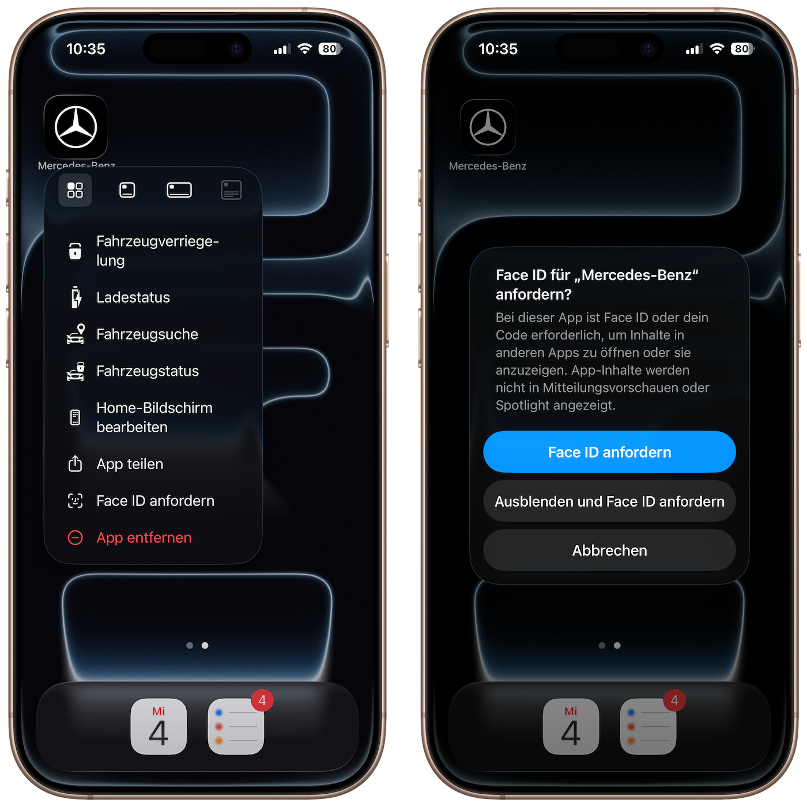


Was kann jemand tun, wenn er ein entsperrtes Smartphone in der Hand hat?


Es gibt einige Sicherheitsfeatures des iPhones, die meiner Meinung nach unterschätzt werden. Zum Beispiel die Möglichkeit, Apps zusätzlich mit Face ID zu schützen. Das ist nicht nur dafür gedacht, bestimmte Apps auszublenden, sondern hat ganz konkrete sicherheitsrelevante Anwendungsfälle.

Nehmen wir an, dir wird das Smartphone gestohlen. Unser Smartphone ist längst ein zentraler Bestandteil unseres Lebens. Darauf befinden sich Banking-Apps, E-Mail-Zugänge, Messenger – und teilweise sogar digitale Autoschlüssel. Natürlich geht es in so einem Fall darum, dass keine Daten übernommen werden und das Gerät nicht weiterverkauft werden kann. Aber mindestens genauso wichtig ist die Frage: 

Was kann jemand tun, wenn er ein entsperrtes Smartphone in der Hand hat?

Mit Zugriff auf ein entsperrtes Gerät eröffnen sich zahlreiche Möglichkeiten, die direkt das Leben der bestohlenen Person betreffen. Bei modernen Fahrzeugen, die über Apps wie Mercedes.me oder die VW-App gesteuert werden, kann beispielsweise unter Umständen das Fahrzeug entriegelt werden. So könnten Wertsachen aus dem Auto entwendet werden. In Banking-Apps lassen sich häufig zumindest Kontostände einsehen, auch wenn für Überweisungen meist eine zusätzliche biometrische Verifizierung erforderlich ist.

Wie schützt man sich also vor einer Situation, in der man beispielsweise in der S-Bahn bedroht wird und gezwungen wird, das Handy zu entsperren? Der wichtigste Rat ist: nicht den Helden spielen. Viel sinnvoller ist es, sich im Vorfeld zu überlegen, was passiert, wenn das Smartphone in falsche Hände gerät, und welche Missbrauchsmöglichkeiten es dann gibt.

Ein sehr nützliches Feature, das viele nicht kennen, ist die seit iOS18 vorhandene Möglichkeit einzelne Apps zusätzlich mit biometrischer Authentifizierung zu schützen. Diese Apps müssen nicht zwingend ausgeblendet werden, aber sie lassen sich so konfigurieren, dass beim Öffnen erneut Face ID erforderlich ist. Eine zusätzliche Absicherung der E-Mail-App kann beispielsweise verhindern, dass jemand Passwörter zurücksetzt, wenn er Zugriff auf ein entsperrtes Gerät hat. Ebenso kann eine Face-ID-Absicherung der Auto-App verhindern, dass das Fahrzeug entriegelt oder Fahrzeuginformationen eingesehen werden. Bei Banking-Apps schützt sie zusätzlich vor dem Auslesen von Kontoständen. Auch Messenger wie Signal oder iMessage lassen sich absichern, sodass niemand im Namen des Opfers Nachrichten verschickt und beispielsweise Familienmitglieder in weitere Betrugsversuche verwickelt.

> [!tip] Aber verzögert dieses Vorgehen nicht die Ladezeit der App immens?
> FaceID ist auf modernen iPhones mittlerweile so schnell, dass die Verzögerung beim Öffnen von Apps, die mit FaceID geschützt sind, vernachlässigbar ist.

Man sieht also: Es ist nicht immer nur ein Vorteil, dass so viel unseres Lebens auf dem Smartphone stattfindet. Gerade deshalb lohnt es sich, sich bewusst mit den Sicherheitsfunktionen auseinanderzusetzen und zusätzliche Schutzmaßnahmen zu aktivieren. Manchmal ist ein kleiner zusätzlicher Aufwand der entscheidende Unterschied, wenn es darauf ankommt.